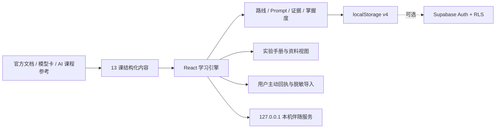

# 设计方案

## 产品目标

目标用户是用过通用聊天模型、但尚未系统掌握 Hermes Agent 的学习者。应用直接进入课程工作台，不使用营销首页。核心目标不是让用户记住命令，而是让其能够解释、执行和验证一个安全工作流。

## 教学设计

课程借鉴 AI-For-Beginners 的 Setup、Pre-Quiz、理论、Lab、Post-Quiz 和延伸阅读结构，并针对 Agent 工程改造成：

```text
课前诊断 -> 四步操作 -> 工具轨迹 -> 实验任务/输入/步骤/成功标准 -> 课后检查 -> 反馈与资料
```

低风险诊断用于推荐快速上手、日常使用或工程进阶路线，不锁课；课后检查与真实实验都通过才计入掌握度。真实实验、浏览器模拟、本机 Companion 和脱敏证据导入明确分层。

## 信息架构

- 左栏：4 个阶段、13 节课、搜索、路线筛选、阶段完成数和课程完成状态。
- 路线中心：三问诊断、三条路径、起点和路径内掌握度。
- 中栏：目标与先修、课前诊断、Agent 轨迹、四步讲解、实验说明、课后检查、来源与前后导航。
- 右栏：总掌握度、诊断数量、本课检查点、针对性反馈和进度重置。
- 练习台：Prompt 契约、脱敏结果评分和故障恢复演练。
- 报告：五类掌握度、Markdown 导出和可选 Supabase 同步。
- 资料研究：官方运行时、模型卡、RL 工具链、AI 教学体系和社区参考。
- 教学架构：学习闭环、前端分层、安全边界和扩展点。

## 功能模块

| 模块 | 职责 | 状态 |
|---|---|---|
| `data.js` | 阶段、课程、诊断、实验、练习、来源 | 静态数据 |
| `learningEngine.js` | 路线推荐、搜索、Prompt、证据评分、掌握度、迁移与云端合并 | 纯函数 |
| `learningViews.jsx` | 路线中心、练习台、报告与云同步界面 | React 状态 |
| `cloudSync.js` | Supabase GitHub/邮箱登录与用户进度仓库 | 动态加载 |
| `InstallGuide` | 桌面、macOS、Windows、WSL2 与飞书的分路径引导 | `activeId` |
| `InteractionPractice` | Desktop 与 Feishu 的安全交互模拟 | `surface`, `stage` |
| `RealInterfaceGuide` | 官方 Desktop 实景标注、飞书双路径 UI 指南与真实操作步骤 | `surface`, `activeId` |
| `LocalOperationVerifier` | 本机伴随服务配对、显式只读检测与浏览器内回执判定 | `serviceState`, `receiptState` |
| `CourseSidebar` | 阶段化目录和完成状态 | `activeLesson`, `completed` |
| `PreQuiz` | 课前诊断与即时解释 | `diagnostics` |
| `CourseView` | 四步讲解、轨迹、资源和导航 | `stepIndex` |
| `LabBrief` | 任务、输入、步骤和成功标准 | 无本地状态 |
| `PracticePanel` | 单选、多选、构建器与课后反馈 | 临时交互状态 |
| `ProgressRail` | 掌握度、检查点和学习反馈 | 派生状态 |
| Persistence | v1-v3 迁移、v4 保存与可选云端合并 | `localStorage` + Supabase |

## 用户流程

1. 用户完成三问诊断，选择快速上手、日常使用或工程进阶路线。
2. 用户从路线起点进入课程，也可以搜索并打开任意一课。
3. 用户对照官方 Desktop 实景标注和飞书双路径指南认识真实界面。
4. 用户在真实应用中执行校验 Prompt，并主动提交回执；需要时点击本机只读检测。
5. 用户使用 Prompt 工作台约束范围和停止条件，并导入脱敏证据取得可解释评分。
6. 用户完成真实实验、恢复动作和课后检查，取得双证据掌握度。
7. 用户在报告中查看能力短板、导出记录，并按需登录同步进度。

## 技术架构



- React + Vite；当前规模使用局部状态，无需额外状态库。
- Lucide React 提供一致图标。
- `hermes-learning-lab-progress-v4` 保存课程 ID、诊断、路线、脱敏评分和最近位置，并迁移 v1-v3。
- Supabase 仅在公共部署变量存在时动态加载；RLS 将每个用户限制在自己的进度行。
- 教学命令仍是字符串；网页不会执行命令，检测通过用户主动启动的本机伴随服务完成。
- 伴随服务仅检查 Hermes 命令是否存在、Desktop 进程、`gateway status` 和 `doctor`，响应只包含白名单字段。
- 不读取配置、密钥、会话、日志或消息；不启动/停止 Desktop 或 Gateway。

## 视觉与响应式

延续原有深色三栏工作台：琥珀色表示当前学习动作，绿色表示已验证，红色只表示错误。区段使用开放边界，实验与课后检查才使用明确面板。桌面为三栏；低于 1180px 隐藏进度栏；低于 820px 课程目录转为抽屉；低于 560px 诊断、实验和导航改为单列。

## 后续扩展

- 隔离容器中的真实命令 runner
- 课程内容版本与命令兼容性提示
- 教师看板与可选匿名班级汇总
- 可下载实验提交物与自动评测
- 模型 Provider 的只读诊断接入
